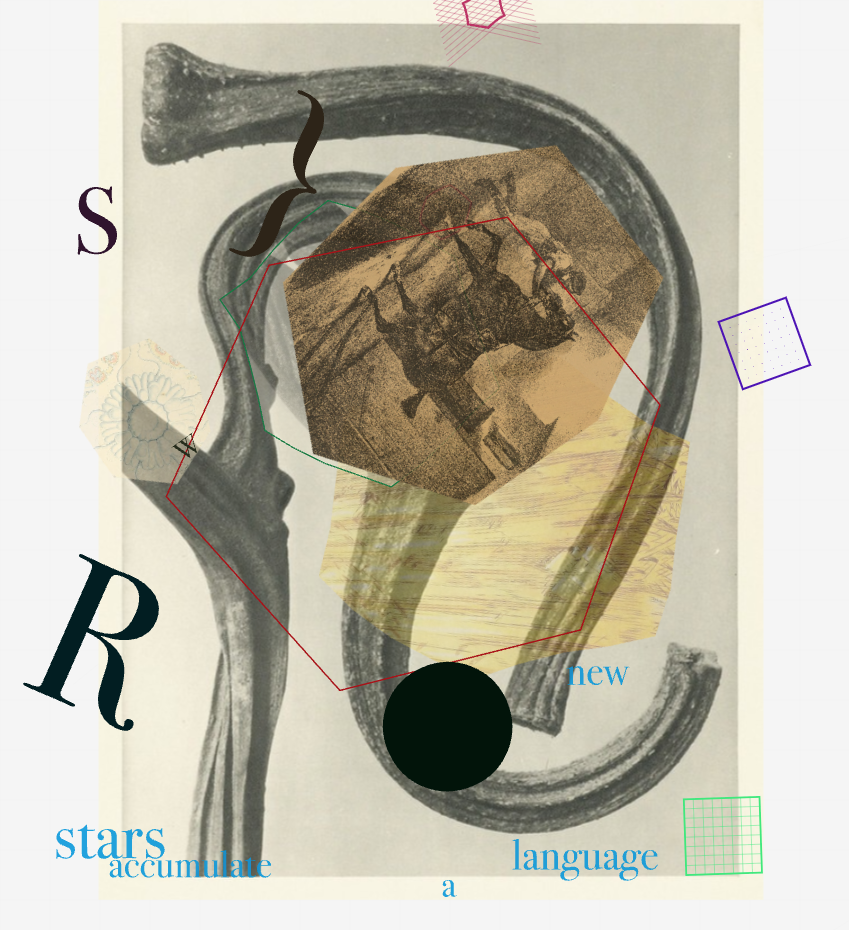
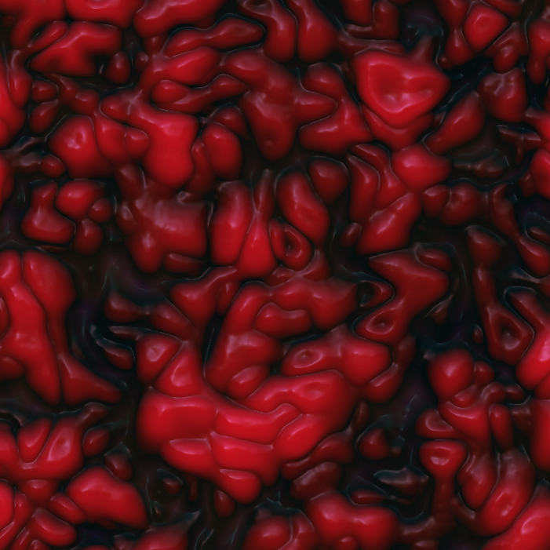

<style scoped>
h1{font-size:1.5em}
h2{font-size:.85em; padding-top:40px}
</style>

# The Function as a Breath of Thought: On the Computer as a Compositional and Performance Tool for Poetry

## Mike Bagwell and William Hazard

---

## The Intersection of Computing and Poetry

- Technological progress continuously shapes artistic expression from the pen to the typewriter
- Creative coding represents a new phase of available capabilities exponentially amplifying potentials already present in poetry
- We'll look at tools, concepts, and examples
  - interactivity with React and p5 in a website I've put together to hold examples
  - theoretical implications of computational randomness
  - Perlin noise and gamma distribution for data visualization of surreality

---


## p5.js: A Toolkit for Creative Coding

- [p5.js](https://p5js.org/) is a free and open-source JavaScript library.
- Designed to make animated, visual and interactive coding accessible to artists, designers, educators, and beginners.
- Based on the [Processing](https://processing.org/) based in Java
- Enables the creation of interactive visuals and experiences directly in web browsers

---

## Example 1: [Interactivity with p5.js + React](https://low-ghost.github.io/interactive-poetry/#/simple-demo)

- Uses [p5-wrapper](https://github.com/P5-wrapper/react), which essentially just uses a ref and calls a new method on the p5 instance

```ts
canvasInstanceRef.current?.updateWithProps?.(
  userProvidedProps as unknown as Props,
);
```

- React enables user interface controls (buttons, sliders) + integrate with existing sites
- Code shows `draw` method, the `ellipse` shape, and color with React controls

---

## Example 2: [Ripple](https://low-ghost.github.io/interactive-poetry/#/ripple)

- an idea I've had since I started programming
- draws a grid of text to canvas and then produces a ripple on mouse move or click
- extensive controls including amplitude, growth rate, the text itself
- emergent properties whenever creative experiment is at play: react controls removing background makes for wild persistent traces

---

### Ripple Interpretation

- interaction brings out meaning in Shakespeare's Sonnet 18: "rough winds", "the eye of heaven", "By chance or nature's changing course"
- to read is to interact, to join in a collaborative creation of meaning
- where does the beloved of the poem become eternal? In the reader, in the 'now' of the moment of reading that encompasses also the entire culture at hand in language's net of meaning and play of signifiers

---

<style scoped>
section{font-size: 1.9em}
</style>

### Ripple Code

- has a lot of trig logic, `p.sin`, `p.cos`, `p.atan2` (for 2 argument archtangent to get the angle from ripple center to character position) etc.
- `strength`: Ripple intensity. Stronger ripples displace text more.
- `growthRate`: How quickly the `radius` increases in each frame of the animation.
- `decayRate`: How quickly the `strength` fades over time. A value slightly less than 1 (e.g., 0.95) means the strength decreases by 5% each frame.
- `amplitude`: Controls the maximum displacement distance of the text affected by the ripple. Think of it like the height of a water wave.
- [createRandomColor](https://github.com/low-ghost/interactive-poetry/blob/main/src/utils/color.ts#L3-L10) generates random rgb values via 3 calls to `p.random(255)`

---

<style scoped>
section{font-size: 1.75em}
img{margin-top:20px}
</style>

## Example 3: [Forest](https://low-ghost.github.io/interactive-poetry/#/forest)

Typographical experiment

precursor to my multimedia, experimental translation of Gilgamesh

Started out as vector art, randomness mimicked via copy/paste of t's


---

### Forest Philosophy

- Trees are distributed according to various algorithms including Perlin noise and actual studies on forest distributions
- Represents a Deleuzian becoming-forest, a mutual disintegration into a new assemblage of systems with emergent properties
- Trees sway to replicate the wind
- A data visualization of that which is at the border of what can be visualized or even conceptualized, a dream data vis

---

<style scoped>
section{font-size:2em}
</style>

### Forest [Code](https://github.com/low-ghost/interactive-poetry/blob/main/src/routes/forest/ForestCanvas.tsx)

- Loading a specific font
- Reproducible randomness with `p.randomSeed(42)`
- Distribution modes:
  - Scaled Perlin noise with `p.noise()`
  - Gaussian distribution `p.randomGaussian(mean, stdDeviation)` for a bell curve to cluster towards the center
  - Gamma equation with a Probability Density Function
- Clicking pulls trees into words
  - `p.lerp` for linear interpolation, combined with `easeOutCubic`
  - centroid calculation

---

<style scoped>
section{font-size: 1.5em}
</style>

<div class="columns">
<div>



### Perlin Noise: Controlled Randomness in Poetry and Computing

- Perlin noise generates smooth, natural-looking randomness
- Developed after working on the original Tron movie by Ken Perlin in 1982
- Provides structure within unpredictability, unlike purely random functions.
- Noise in poetry: sounds, interruptions, overheard conversations. My Poem of Thanks with kids movies and closed caption subtitles
- In p5, we have access with `p.noise()`
- In [Forest](https://low-ghost.github.io/interactive-poetry/#/forest), it's just another distribution option.

</div>
<div>


</div>
</div>

---

## Example 3: [Towards](https://low-ghost.github.io/interactive-poetry/#/towards)

- Extends William S. Burroughs' cutup technique digitally
- Randomly selects and positions public domain images with random opacity and complex shapes
- Predefined poem animates through the frames, order within that frame is indeterminate
- Generates unexpected juxtapositions and new meaning

---

## Bergson's Concept of Lived Duration

- Henri Bergson's philosophy contrasts subjective, lived time with objective, scientific time.
- "Duration" is a continuous, flowing, and indivisible experience, intertwined with consciousness and memory.
- Digital poetry can engage with this subjective experience of time.
- User interactions can influence the pace and unfolding of a poem.
- Computational temporality (delays, loops) can create poetic rhythms reflecting duration.

---

## The Poetic Computer: An Instrument

- The computer can be an instrument for poetic composition and performance
- Instantaneous communication, live collaboration between various readers and authors
- Augments human creativity, not replacing it
- Lot of new avenues for collaborative human-computer artistic expression
