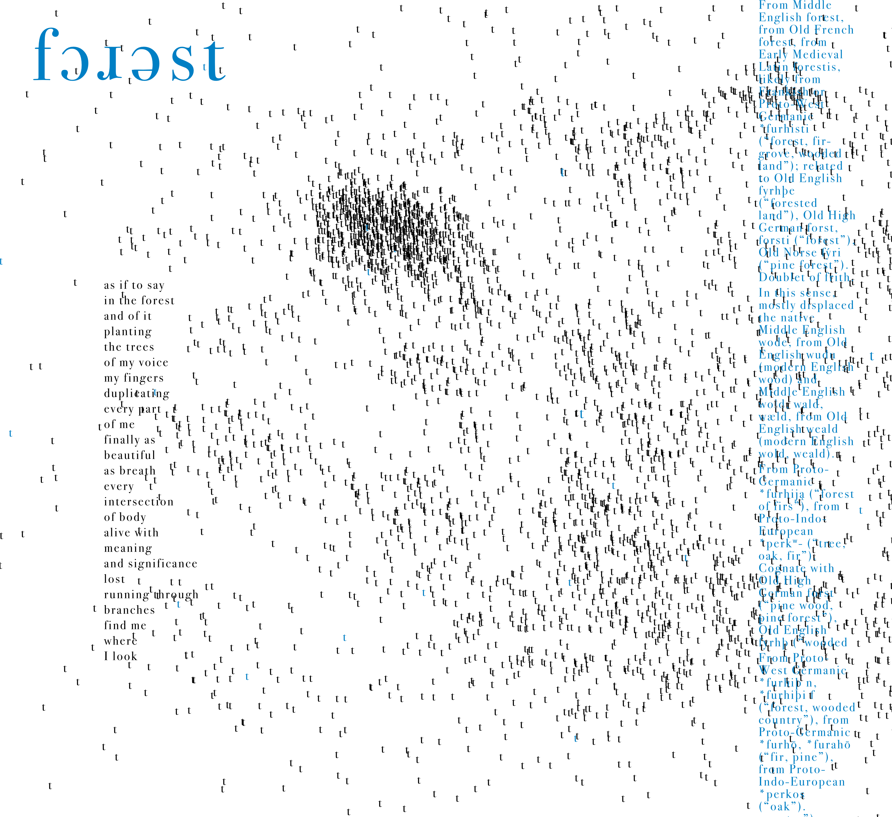

<style scoped>
h1{font-size:1.5em}
h2{font-size:.85em; padding-top:40px}
</style>

# The Function as a Breath of Thought: On the Computer as a Compositional and Performance Tool for Poetry

## Mike Bagwell and William Hazard

---

## The Intersection of Computing and Poetry

- Technological progress continuously shapes artistic expression
- Creative coding represents a new phase of available capabilities exponentially amplifying potentials already present in poetry
- We'll look at tools, concepts, and examples
  - interactivity with React
  - theoretical implications of computational randomness
  - Perlin noise and gamma distribution for data visualization of surreality

---


## p5.js: A Toolkit for Creative Coding

- [p5.js](https://p5js.org/) is a free and open-source JavaScript library.
- Designed to make animated, visual and interactive coding accessible to artists, designers, educators, and beginners.
- Based on the [Processing](https://processing.org/) based in Java
- Enables the creation of interactive visuals and experiences directly in web browsers.

---

## Example 1: [Interactivity with p5.js + React](https://low-ghost.github.io/interactive-poetry/#/simple-demo)

- Uses [p5-wrapper](https://github.com/P5-wrapper/react), which essentially just uses a ref and calls a new method on the p5 instance

```ts
canvasInstanceRef.current?.updateWithProps?.(
  userProvidedProps as unknown as Props,
);
```

- React enables user interface controls (buttons, sliders) + integrate with existing sites
- Code shows `draw` method, the `ellipse` shape, and color with React controls

---

## Example 2: [Ripple](https://low-ghost.github.io/interactive-poetry/#/ripple)

- an idea I've had since I started programming
- draws a grid of text to canvas and then produces a ripple on mouse move or click
- extensive controls including amplitude, growth rate, the text itself
- emergent properties whenever creative experiment is at play: react controls removing background makes for wild persistent traces

---

### Ripple Interpretation

- interaction brings out meaning in Shakespeare's Sonnet 18: "rough winds", "the eye of heaven", "By chance or nature's changing course"
- to read is to interact, to join in a collaborative creation of meaning
- where does the beloved of the poem become eternal? In the reader, in the 'now' of the moment of reading that encompasses also the entire culture at hand in language's net of meaning and play of signifiers

---

<style scoped>
section{font-size: 1.9em}
</style>

### Ripple Code

- has a lot of trig logic, `p.sin`, `p.cos`, `p.atan2` (for 2 argument archtangent to get the angle from ripple center to character position) etc.
- `strength`: Ripple intensity. Stronger ripples displace text more.
- `growthRate`: How quickly the `radius` increases in each frame of the animation.
- `decayRate`: How quickly the `strength` fades over time. A value slightly less than 1 (e.g., 0.95) means the strength decreases by 5% each frame.
- `amplitude`: Controls the maximum displacement distance of the text affected by the ripple. Think of it like the height of a water wave.
- [createRandomColor](https://github.com/low-ghost/interactive-poetry/blob/main/src/utils/color.ts#L3-L10) generates random rgb values via 3 calls to `p.random(255)`

---

<style scoped>
section{font-size: 1.75em}
img{margin-top:20px}
</style>

## Example 3: [Forest](https://low-ghost.github.io/interactive-poetry/#/forest)

Typographical experiment, precursor to my multimedia, experimental translation of Gilgamesh. Started out as vector art, randomness mimicked via copy/paste of t's (click for fullscreen)

<a href="images/forest-original.jpg">
  
</a>

---

### Forest Philosophy

- Trees are distributed according to various algorithms including Perlin noise and actual studies on forest distributions
- Represents a Deleuzian becoming-forest
- Trees sway to replicate the wind
- A data visualization of that which is at the border of what can be visualized or even conceptualized, a dream data vis
